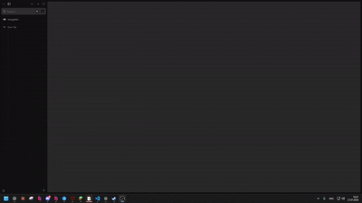
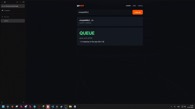
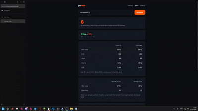
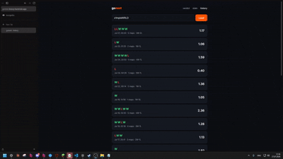

# gonext


**gonext analyzes YOU - not the opponents.**

Most FACEIT tools scout the enemy team. gonext looks at your own recent matches and tells you one thing; should you queue again, or stop before you tilt away your elo?


**Live:** https://gonext.brizzy.hackclub.app



## Why I built this

A lot of CS2 players especially on FACEIT, me icluded keep playing after two losses. Thats the moment things spiral, you lose more than you should, tilt sets in, and you levae your PC exhausted and blue at the end of a day. I was part of it, untill i decided to build an app to help me stop before it happens.

## What it does

**Verdict** - analyzes your last matches and gives ypu one of 4 calls:

- **QUEUE** - you are freshly ready

- **RISKY** - you can play, but i woldnt recommend it
- **STOP** - 2 losses, playing next is likely to be rage and tilt
- **BANK IT** - you made it, now rest

**Stats** - so you can see what to improve and how to level up : baseline vs kifetime, day/hight performance stats, map performance and a tilt spiral backtest



**History** - every session you have played, grouped and scored: W/L, K/D and how you performed that day.



## How it works

The app pulls your match history from FACEIT and groups it into **sessions** - matches less than 2 hours apart count as one session.

The **decider** runs hard rules first:
- two losses in a row > **STOP**
- three oe more matches ending with a win > **BANK IT**

If no hard rule fires, it scores the session out of 100 and applies modifiers:
| Signal | Effect |
|---|---|
| Lost last match | −15 |
| Won last match | +10 |
| Session KD below your baseline | −10 to −20 |
| ADR declining through the session | −15 |
| 6+ matches in 24h (fatigue) | −15 |
| Late night in Tashkent (01:00–08:00) | −10 |
70+ → QUEUE, 40–69 → RISKY, under 40 → STOP.
Every verdict lists the reasons that fired in a plain words - the reason matters more than a number.

## Problems I hit
- **Timestamps in milliseconds** FACEIT returns match times in milliseconds, not seconds. My 2 hour session gap was being treated as a 7 seconds untill i caught x1000
- **Fused decider rules** My STOP rule was returning BANK IT message two rules collapsed into one during an edit. Found it by a unit test
- **And many more mini bugs**

## Tech

Django 6, Python 3.14, Faceit Data API (per match elo isn't in the official API, so the backtest uses a ±25 proxy), Gunicorn and systemd, Hack Club Nest

## Run it locally:

```bash
git clone https://github.com/brizzzzuy/gonext.git
cd gonext
python -m venv venv
venv\Scripts\activate    # Windows;  source venv/bin/activate on Mac/Linux
pip install -r requirements.txt
```
Create a `.env` file in project root:

FACEIT_API_KEY=your_key_here # get one at developers.faceit.com
SECRET_KEY=your_django_secret_key

Then:

```bash
python manage.py migrate
python manage.py runserver
```

## AI disclosure

I used Claude as a debugger when I could not find some bugs myself. All the code was written by me.
